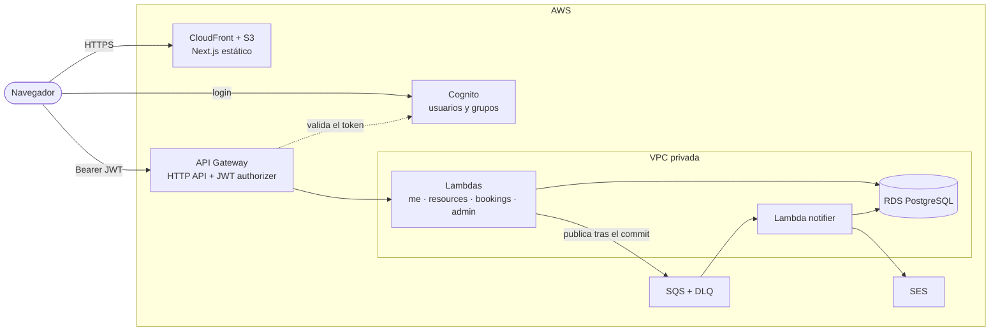

# Reservas: sistema de reservas serverless en AWS

[](https://github.com/jcorta/pocAwsLambda/actions/workflows/ci.yml)
[](LICENSE)

> **In short (EN):** a resource-booking system on serverless AWS (API Gateway, Lambda, RDS PostgreSQL, Cognito, SQS, SES, S3 and CloudFront), written in TypeScript with Terraform. Double bookings are impossible by design: a PostgreSQL exclusion constraint enforces it, and a concurrency test proves it. The whole stack runs locally on an AWS emulator with the same Terraform modules intended for AWS, and the CI runs API and UI end-to-end tests on every pull request. The AWS deployment tooling (`aws:deploy` / `aws:destroy`, OIDC pipeline) is in place and covered by `terraform test`. The documentation is in Spanish.

Sistema de **reservas de recursos por turnos** (salas, equipos, canchas…) que garantiza que nunca haya dos reservas sobre el mismo turno. Es una prueba de concepto de punta a punta de una arquitectura serverless en **AWS**, con infraestructura como código, tests en todos los niveles y CI/CD.

| Entorno | Para qué | Infra |
|---|---|---|
| **AWS** | El destino del proyecto | `infra/envs/aws`, deploy con `aws:deploy` o con `deploy-aws.yml` |
| **Local** | Desarrollar y probar sin costo, en tu máquina y en la CI, sobre [Floci](https://github.com/floci-io/floci), un emulador de AWS | `infra/envs/local`, con los mismos módulos de Terraform |

**Estado:** la aplicación, la infraestructura y el pipeline están completos y probados de punta a punta en el entorno local, y en la CI en cada PR. El despliegue completo en AWS está en curso (ver [Despliegue en AWS](#despliegue-en-aws)).



| | |
|---|---|
| **Backend** | API Gateway HTTP API, Lambdas en Node.js 22 y TypeScript, Drizzle ORM, Zod, Temporal |
| **Datos** | RDS PostgreSQL 16. Las dobles reservas las impide una *exclusion constraint* de la base |
| **Auth** | Cognito (email y contraseña, grupos `admin` y `user`) |
| **Notificaciones** | SQS, una Lambda idempotente y SES |
| **Frontend** | Next.js 16 con export estático, React 19, Tailwind 4 y TanStack Query |
| **Infra** | Terraform con módulos compartidos y un root por entorno (`envs/local`, `envs/aws`) |
| **Tests** | Vitest (unit e integración con Testcontainers), `terraform test`, E2E de la API y Playwright |
| **CI/CD** | GitHub Actions: lint, tests, build y E2E contra el entorno local en cada PR. Deploy a AWS por OIDC, con aprobación manual |

## Decisiones de diseño

- **Una doble reserva es imposible por diseño, no por código.** Una *exclusion constraint* de PostgreSQL (`btree_gist`) rechaza cualquier solapamiento. Un test de integración lanza 20 usuarios en paralelo contra el mismo turno y verifica que haya exactamente 1 reserva y 19 rechazos. El límite de reservas por usuario también se sostiene bajo concurrencia, con un bloqueo de fila.
- **Las fechas se calculan en tiempo absoluto, con Temporal.** Los turnos se generan correctamente en los días de cambio de hora, y los tests cubren una zona sin horario de verano (Buenos Aires) y otra con él (Nueva York).
- **Las notificaciones no afectan a la reserva.** Se publican en SQS después del commit; una Lambda las procesa de forma idempotente por `event_id`, con reintentos y una DLQ al tercer intento.
- **Un solo contrato.** Los esquemas Zod de `packages/shared` los usan la API, el frontend y los E2E, que validan cada respuesta contra ellos.
- **Seguridad:** el frontend guarda los tokens solo en memoria (nunca en `localStorage` ni en cookies), la Lambda exige un ID token, y no hay secretos en el repo: gitleaks corre en un hook de pre-commit y en la CI.
- **La infraestructura se prueba.** `terraform test` verifica, entre otras cosas, que no haya rutas `{proxy+}`, que solo la Lambda de reservas publique en SQS y solo el notifier envíe emails, que RDS sea privada y que el bucket del sitio solo lo lea CloudFront.
- **Mismos módulos para el emulador y para AWS.** Las diferencias viven únicamente en `infra/envs/*`. Probar contra el emulador dejó 10 hallazgos documentados en [`docs/spikes/floci.md`](docs/spikes/floci.md), como la falta de CORS en Cognito y en la API.
- **Un entorno que se borra solo y sin sorpresas.** `pnpm aws:destroy` borra en orden y verifica por tags que no quede nada antes de tocar el state. Una sesión de prueba en AWS cuesta menos de 0,30 USD, según la estimación del [SPEC §11.2](docs/SPEC.md).

## Prerequisitos

Solo necesitás dos cosas instaladas. Lo demás (Floci, Terraform, Postgres de los tests y gitleaks) corre en contenedores.

- **Docker** con Compose v2: Docker Desktop en Windows y macOS (en Windows, con WSL2), o Docker Engine en Linux. Se recomiendan al menos 4 GB de memoria para Docker.
- **Node.js 24** o superior (ver `.nvmrc`). pnpm viene con Node a través de corepack.

Funciona igual en Windows, macOS y Linux.

## Inicio rápido (entorno local)

```sh
git clone https://github.com/jcorta/pocAwsLambda.git
cd pocAwsLambda

corepack enable       # 1. Habilita pnpm con la versión del repo (en Windows puede pedir una terminal de administrador)
npm run doctor        # 2. Verifica los prerequisitos y sugiere cómo resolver lo que falte
pnpm install          # 3. Instala las dependencias
pnpm local:up         # 4. Levanta todo: Floci, infraestructura, migraciones y datos de ejemplo
```

La primera vez, `pnpm local:up` tarda unos **3 minutos**: descarga las imágenes de Docker y crear la base de datos lleva unos 90 s. Las siguientes veces tarda menos. Es idempotente, así que se puede volver a correr. Al final muestra las URLs y los usuarios de prueba.

Después, para abrir la aplicación:

```sh
pnpm dev              # Frontend en http://localhost:3000
```

Entrá con alguno de los usuarios que crea el seed. Las contraseñas están en `.env.local`, que se crea a partir de `.env.example`:

| Rol | Email | Contraseña |
|---|---|---|
| Admin | `admin@example.com` | `Admin-local-1` |
| Usuario | `user@example.com` | `User-local-1` |

Qué podés probar:
- **Como usuario:** elegir un recurso, ver los turnos disponibles de un día, reservar uno y cancelarlo desde "Mis reservas". Las reglas se aplican: no más de 3 reservas activas, hasta 30 días de anticipación y cancelación hasta 2 h antes.
- **Como admin:** crear y editar recursos con su horario, ver todas las reservas, cancelar la de cualquiera y cambiar la configuración.
- **Registrarte** con un email nuevo. El código de verificación y los emails de cada reserva se ven en la bandeja de Floci UI (`pnpm local:up --ui`, en `http://localhost:4500`).

Para terminar:

```sh
pnpm local:down       # Baja el entorno (Floci es efímero: los datos se pierden)
```

## Comandos frecuentes

| Comando | Qué hace |
|---|---|
| `npm run doctor` | Verifica los prerequisitos |
| `pnpm local:up [--ui]` | Levanta el entorno local completo. Con `--ui` suma Floci UI en `:4500` |
| `pnpm dev` | Frontend con recarga en caliente en `http://localhost:3000` |
| `pnpm deploy:local` | Ciclo rápido después de cambiar el backend: build, Terraform y migraciones |
| `pnpm deploy:web:local` y `pnpm local:site` | Publica el sitio en el S3 de Floci y lo sirve en `http://localhost:3002` |
| `pnpm local:logs [lambda]` | Logs de Floci o de una Lambda (`me`, `resources`, `bookings`, `admin`, `migrator` o `notifier`) |
| `pnpm local:down` / `pnpm local:reset` | Baja el entorno. `reset` además borra el state de Terraform y lo generado |
| `pnpm test` | Tests unitarios, con umbrales de cobertura |
| `pnpm test:integration` | Tests contra un Postgres real (Testcontainers) |
| `pnpm lint:infra` / `pnpm test:infra` | `fmt`, `validate`, `tflint` y `terraform test` de la infraestructura |
| `pnpm test:e2e` / `pnpm test:e2e:ui` | E2E de la API y de la UI contra el entorno levantado |
| `pnpm lint` / `pnpm typecheck` / `pnpm format` | Calidad de código |

La lista completa y sus detalles están en [`AGENTS.md`](AGENTS.md#comandos).

## Estructura

```
apps/web/          Frontend Next.js (export estático)
services/api/      Lambdas: dominio puro, servicios, repositorios, handlers y migraciones
packages/shared/   Contrato de la API: esquemas Zod y códigos de error
infra/             Terraform: modules/, envs/local (Floci), envs/aws y bootstrap/ (state y OIDC)
scripts/           doctor y scripts del entorno local, todos en Node
docs/              Especificación, tareas y resultados del spike de Floci
```

## Problemas frecuentes

- **`doctor` falla en "Socket de Docker desde contenedores".** Floci levanta las Lambdas y la base como contenedores hermanos, así que necesita el socket de Docker. En Docker Desktop: *Settings → Advanced → Allow the default Docker socket to be used*.
- **Un puerto está ocupado.** El entorno usa 4566, 3000 y 7001–7010. `doctor` dice qué comando usar para ver qué proceso lo tiene.
- **La API o el sitio no resuelven sin conexión a Internet.** Las URLs `*.localhost.floci.io` dependen de un DNS público que responde `127.0.0.1`. Para trabajar sin conexión, agregá una entrada en el archivo `hosts` con el host que muestra `local:up`.
- **El login falla al abrir el sitio directo del bucket o `:3001`.** Cognito de Floci no soporta CORS, así que el navegador tiene que entrar por el proxy local: `http://localhost:3000` (`pnpm dev`) o `http://localhost:3002` (`pnpm local:site`).
- **Algo quedó en un estado raro.** `pnpm local:reset` y después `pnpm local:up` dejan todo como nuevo.
- **En Windows, `pnpm` falla con "El sistema no puede encontrar la ruta especificada".** Las rutas de `node_modules` superan los 260 caracteres. Cloná el repo en una carpeta de ruta corta (por ejemplo `C:\dev\pocAwsLambda`) o habilitá las rutas largas de Windows.
- **No puedo commitear.** El hook de pre-commit corre gitleaks en Docker, así que Docker tiene que estar corriendo.

## Documentación

- [`docs/SPEC.md`](docs/SPEC.md): la especificación completa. Incluye las reglas de negocio, el contrato de la API, la arquitectura, la infra, la estrategia de tests, el CI/CD y el despliegue en AWS.
- [`docs/TASKS.md`](docs/TASKS.md): las fases de implementación y su avance.
- [`docs/spikes/floci.md`](docs/spikes/floci.md): qué funciona en Floci y las diferencias con AWS encontradas en el camino (hallazgos A1 a A10).
- [`AGENTS.md`](AGENTS.md): convenciones del repo, para personas y para agentes de código.

## Despliegue en AWS

Es el objetivo del proyecto (fase F7) y está en curso. El entorno de AWS se usa por sesiones: se despliega, se prueba y se borra entero. **Una sesión de 3 h cuesta menos de 0,30 USD** (estimado).

**Estado:** una primera sesión desplegó los 85 recursos en 14 minutos, con los 5 smoke tests en verde, el registro de un usuario real y una reserva de punta a punta. Falta probar el pipeline (`deploy-aws.yml`) con un cambio de una Lambda. Un límite conocido: con un remitente `@gmail.com`, SES acepta los emails de las reservas pero Gmail no los muestra (ver [SPEC §11.3](docs/SPEC.md)).

En AWS, las Lambdas corren en subnets privadas sin salida a Internet: llegan a Secrets Manager, SQS y SES por VPC endpoints. El sitio se sirve por CloudFront con HTTPS, desde un bucket privado.

**Prerequisitos:**
- Una cuenta de AWS, con una alerta de AWS Budgets de 1 USD.
- La [AWS CLI v2](https://docs.aws.amazon.com/cli/latest/userguide/getting-started-install.html) con una sesión iniciada (`aws login` o `aws sso login`).
- `infra/envs/aws/terraform.tfvars`, copiado del `.example`, con tu email en `ses_from`.

```sh
pnpm aws:deploy             # Bootstrap, build, plan (pide confirmación), apply, migraciones, sitio y smoke tests (~15 min)
pnpm aws:admin <tu-email>   # Te hace admin, después de registrarte en el sitio
pnpm aws:destroy            # Borra todo, incluido el bucket del state. Hasta entonces se cobra por hora
```

- **Cambios después del primer deploy:** van por PR. Una vez mergeados, se despliegan con el workflow `deploy-aws.yml` (a mano, con aprobación).
- **Emails:** SES queda en *sandbox*, así que solo envía a direcciones verificadas. Registrate con el mismo email de `ses_from`.
- **Más detalle:** los pasos completos, los costos y los riesgos están en [SPEC §11](docs/SPEC.md#11-despliegue-en-aws-y-riesgos).

## Licencia

[MIT](LICENSE).
